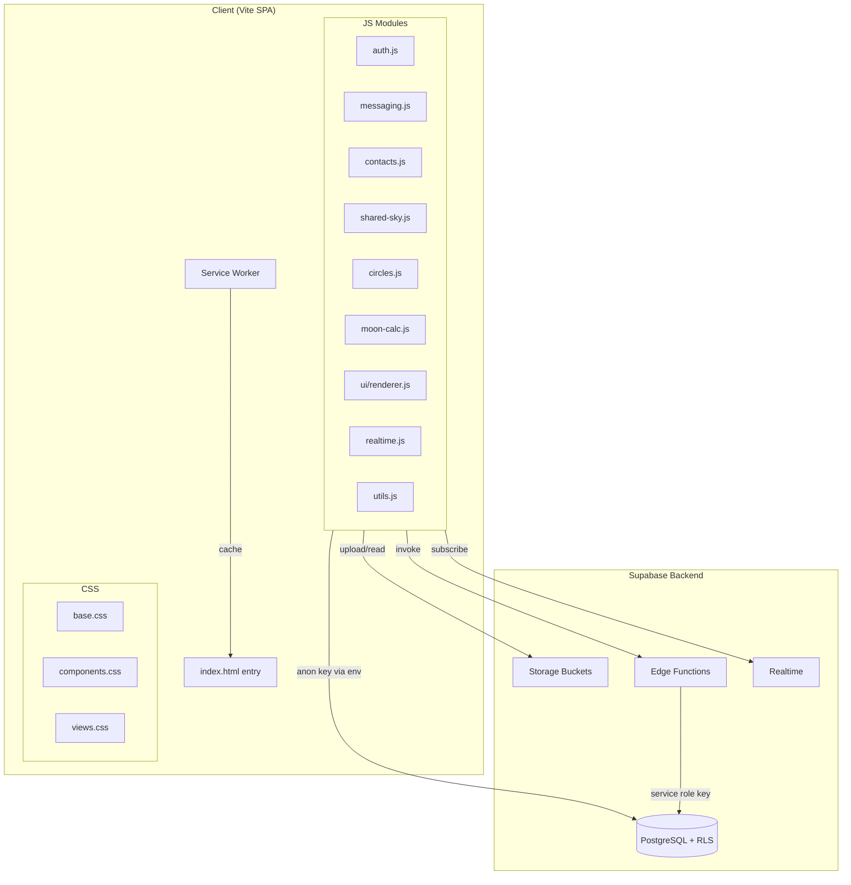

# Design Document: Security Architecture Overhaul

## Overview

This design covers the security lockdown and architectural decomposition of MoonPop, a PWA messaging app where messages are gated by moon rise/set times. The current application is a single 21,000-line `index.html` with hardcoded Supabase credentials and zero Row Level Security (RLS) policies. Any user with the anon key can read/write all data.

The overhaul has three pillars:

1. **Security**: Enable RLS on all 12 tables, add storage bucket policies, move sensitive operations to Edge Functions, and remove hardcoded credentials
2. **Architecture**: Decompose the monolith into ES modules with a Vite build system
3. **Preservation**: Maintain 100% feature parity through the transition

### Design Decisions

- **Vite** as the build system: zero-config for vanilla JS, native ES module support, fast HMR, built-in env variable injection (`import.meta.env.VITE_*`), and Vercel-native build support
- **Vanilla JS** (no framework migration): minimizes risk and scope; the goal is decomposition, not rewrite
- **SQL migration files** for RLS policies: version-controlled, reviewable, and replayable via Supabase CLI
- **Supabase Edge Functions** (Deno) for sensitive operations: already partially in use (`send-message`, `send-email`), consistent with existing patterns

## Architecture

### High-Level Architecture



### Security Architecture

```mermaid
graph LR
    subgraph Client
        App[MoonPop SPA]
    end

    subgraph Supabase
        subgraph "Auth Layer"
            JWT[JWT / auth.uid]
        end
        subgraph "Data Layer"
            RLS[RLS Policies]
            DB[(Tables)]
        end
        subgraph "Server Layer"
            EF[Edge Functions]
            SRK[Service Role Key]
        end
        subgraph "Storage Layer"
            SP[Storage Policies]
            Buckets[avatars / moon-photos]
        end
    end

    App -->|anon key + JWT| JWT
    JWT -->|auth.uid()| RLS
    RLS -->|filter rows| DB
    App -->|invoke| EF
    EF -->|service role| SRK
    SRK -->|bypass RLS| DB
    App -->|upload with JWT| SP
    SP -->|path validation| Buckets
```

### Project Structure

```
moonpop/
├── public/
│   ├── sw.js                  # Service worker (not bundled)
│   ├── manifest.json
│   └── assets/                # Static SVGs, icons
├── src/
│   ├── main.js                # Entry point, Supabase init, router
│   ├── config.js              # Environment variable access
│   ├── services/
│   │   ├── supabase.js        # Supabase client singleton
│   │   ├── auth.js            # Auth flows (OTP, session)
│   │   ├── messaging.js       # Message CRUD, send via Edge Function
│   │   ├── contacts.js        # Contact management
│   │   ├── shared-sky.js      # Shared Sky posts, reactions
│   │   ├── circles.js         # Moon Circles CRUD
│   │   ├── realtime.js        # Realtime subscriptions, polling
│   │   ├── storage.js         # Avatar/photo upload helpers
│   │   └── notifications.js   # Push notification registration
│   ├── lib/
│   │   ├── moon-calc.js       # SunCalc wrappers, phase, rise/set
│   │   ├── cities.js          # City data for location selection
│   │   └── utils.js           # Date formatting, helpers
│   ├── ui/
│   │   ├── renderer.js        # DOM rendering, view switching
│   │   ├── components.js      # Reusable UI components
│   │   └── settings.js        # Settings panel logic
│   └── styles/
│       ├── base.css            # Reset, variables, typography
│       ├── components.css      # Buttons, cards, inputs
│       └── views.css           # View-specific layouts
├── supabase/
│   ├── migrations/
│   │   ├── 001_enable_rls.sql
│   │   ├── 002_profiles_policies.sql
│   │   ├── 003_messages_policies.sql
│   │   ├── 004_replies_policies.sql
│   │   ├── 005_contacts_policies.sql
│   │   ├── 006_shared_sky_policies.sql
│   │   ├── 007_reactions_policies.sql
│   │   ├── 008_read_receipts_policies.sql
│   │   ├── 009_blocked_users_policies.sql
│   │   ├── 010_circles_policies.sql
│   │   └── 011_storage_policies.sql
│   └── functions/
│       ├── send-message/index.ts
│       ├── send-email/index.ts
│       └── release-message/index.ts
├── index.html                  # Vite entry HTML
├── package.json
├── vite.config.js
├── vercel.json
├── .env.example
└── .gitignore
```

## Components and Interfaces

### 1. Supabase Client Module (`src/services/supabase.js`)

Singleton Supabase client initialized from environment variables.

```js
// src/services/supabase.js
import { createClient } from '@supabase/supabase-js'

const supabaseUrl = import.meta.env.VITE_SUPABASE_URL
const supabaseAnonKey = import.meta.env.VITE_SUPABASE_ANON_KEY

export const sb = createClient(supabaseUrl, supabaseAnonKey)
```

### 2. Auth Service (`src/services/auth.js`)

Handles OTP sign-in, session management, profile creation on first login.

```js
// Interface
export async function signInWithOtp(email) → { error? }
export async function verifyOtp(email, token) → { session?, error? }
export async function getSession() → { session? }
export async function signOut() → void
export function onAuthStateChange(callback) → { unsubscribe }
```

### 3. Messaging Service (`src/services/messaging.js`)

All message operations. `sendMessage` calls the Edge Function exclusively (no direct-insert fallback).

```js
// Interface
export async function sendMessage(payload) → { data?, error? }
export async function loadInbox() → { sent, received }
export async function releaseMessages() → void
export async function loadReplies(messageId) → Reply[]
export async function sendReply(messageId, payload) → { data?, error? }
export async function sendLunarNote(messageId, payload) → { data?, error? }
```

### 4. Contacts Service (`src/services/contacts.js`)

```js
export async function loadContacts() → Contact[]
export async function addContact(email, name) → Contact
export async function deleteContact(id) → void
export async function syncContactProfiles() → void
export async function blockUser(profileId, email) → void
export async function unblockUser(blockId) → void
export async function getBlockedUsers() → BlockedUser[]
```

### 5. Shared Sky Service (`src/services/shared-sky.js`)

```js
export async function loadSharedSkyPosts() → Post[]
export async function createPost(payload) → Post
export async function deletePost(id) → void
export async function addReaction(messageId, emoji) → void
export async function removeReaction(messageId, emoji) → void
```

### 6. Circles Service (`src/services/circles.js`)

```js
export async function loadCircles() → Circle[]
export async function createCircle(name, emoji) → Circle
export async function addMember(circleId, userId) → void
export async function addContribution(nightId, payload) → void
```

### 7. Realtime Service (`src/services/realtime.js`)

Manages all Supabase Realtime channel subscriptions and polling fallback.

```js
export function setupRealtime(userId, callbacks) → void
export function cleanupRealtime() → void
// callbacks: { onNewMessage, onMessageUpdate, onNewReply, onReadReceipt, onProfileUpdate, onSharedSkyPost }
```

### 8. Moon Calculation Library (`src/lib/moon-calc.js`)

Pure functions wrapping SunCalc. No Supabase dependency.

```js
export function getMoonPhase(date?) → PhaseInfo
export function getMoonZodiac(date?) → ZodiacInfo
export function calculateMoonTimes(lat, lon) → MoonTimes
export function isMoonVisible(time, lat, lon) → boolean
export function getRecipientMoonrise(cityName) → Date?
export function timeToRingDegrees(date) → number
```

### 9. Edge Functions

#### `send-message` (existing, to be hardened)

```ts
// Validates: sender matches JWT, payload shape, rate limit
// Inserts via service role key
// Returns: { message: MessageRow } or { error: string }
```

#### `release-message` (new)

```ts
// Validates: requester is the recipient (by id or email)
// Updates status to 'released' via service role key
// Returns: { updated: number } or { error: string }
```

### 10. Storage Upload Helper (`src/services/storage.js`)

```js
export async function uploadAvatar(userId, blob) → string // returns public URL
export async function uploadMoonPhoto(context, userId, blob) → string
```

## Data Models

### RLS Policy Model

All 12 tables get RLS enabled. The policy pattern per table:

| Table | SELECT | INSERT | UPDATE | DELETE |
|-------|--------|--------|--------|--------|
| `profiles` | Own row: all cols. Others: public cols only | `id = auth.uid()` | `id = auth.uid()` | Denied |
| `messages` | `sender_id = uid OR recipient_id = uid OR recipient_email = jwt.email` | `sender_id = auth.uid()` | `recipient_id = uid OR recipient_email = jwt.email` | Denied |
| `replies` | Joined: user participates in parent message | `sender_id = uid AND participates in message` | Participates in parent message | Denied |
| `contacts` | `owner_id = auth.uid()` | `owner_id = auth.uid()` | `owner_id = auth.uid()` | `owner_id = auth.uid()` |
| `shared_sky` | All rows (public) | `user_id = auth.uid()` | `user_id = auth.uid()` | `user_id = auth.uid()` |
| `reactions` | On accessible messages | `user_id = auth.uid()` | — | `user_id = auth.uid()` |
| `read_receipts` | `user_id = uid OR participates in conversation` | `user_id = auth.uid()` | `user_id = auth.uid()` | — |
| `blocked_users` | `blocker_id = auth.uid()` | `blocker_id = auth.uid()` | — | `blocker_id = auth.uid()` |
| `moon_circles` | Member of circle | `creator_id = auth.uid()` | Creator only | Creator only |
| `circle_members` | Member of circle | Circle creator/admin | — | Circle creator/admin |
| `circle_nights` | Member of circle | Member of circle | — | — |
| `circle_contributions` | Member of circle | `user_id = uid AND member of circle` | — | — |

### Profiles SELECT Policy Detail

The profiles table requires a column-level restriction. Since PostgreSQL RLS operates at the row level, we implement this with a **security-definer function** that returns a restricted view:

```sql
-- Option: Use a view for public profile access
CREATE OR REPLACE VIEW public_profiles AS
SELECT id, username, first_name, last_name, city, avatar_url
FROM profiles;

-- RLS on profiles table: full access to own row
CREATE POLICY "Users can read own full profile"
ON profiles FOR SELECT
USING (id = auth.uid());

-- For other users' profiles, client queries public_profiles view
```

Alternatively, since the app already selects specific columns in most queries, the simpler approach is:
- RLS allows SELECT on all rows (profiles are semi-public)
- The `email` column is excluded from client queries by convention and enforced by the Edge Function layer for sensitive operations

Given the current codebase already selects specific columns (`id, username, first_name, last_name, city, avatar_url, email`), the pragmatic approach is:

```sql
-- All authenticated users can read all profile rows
CREATE POLICY "Authenticated users can read profiles"
ON profiles FOR SELECT TO authenticated
USING (true);

-- Own profile: full column access (handled by query)
-- Other profiles: client selects only public columns
-- Email column access is restricted at the application layer
```

### Storage Policy Model

```sql
-- Avatars bucket
CREATE POLICY "Users upload own avatar"
ON storage.objects FOR INSERT TO authenticated
WITH CHECK (bucket_id = 'avatars' AND (storage.foldername(name))[1] = auth.uid()::text);

CREATE POLICY "Public avatar read"
ON storage.objects FOR SELECT
USING (bucket_id = 'avatars');

-- Moon-photos bucket
CREATE POLICY "Users upload own moon photos"
ON storage.objects FOR INSERT TO authenticated
WITH CHECK (bucket_id = 'moon-photos' AND (storage.foldername(name))[2] = auth.uid()::text);

CREATE POLICY "Public moon photo read"
ON storage.objects FOR SELECT
USING (bucket_id = 'moon-photos');
```

### Edge Function Request/Response Models

#### send-message

```ts
// Request
interface SendMessageRequest {
  recipient_email: string
  recipient_id?: string
  text?: string
  photo_url?: string
  sender_city: string
  recipient_city: string
  release_at?: string       // ISO timestamp
  status: 'in_transit' | 'released'
  moon_phase?: string
  // ... other message fields
}

// Response (success)
interface SendMessageResponse {
  message: MessageRow
}

// Response (error)
interface ErrorResponse {
  error: string
  code?: string
}
```

#### release-message

```ts
// Request
interface ReleaseMessageRequest {
  message_ids: string[]     // UUIDs of messages to release
}

// Response
interface ReleaseMessageResponse {
  updated: number
}
```

### Environment Variables

```
VITE_SUPABASE_URL=https://your-project.supabase.co
VITE_SUPABASE_ANON_KEY=eyJ...
```

Build-time only (Vercel / CI):
```
SUPABASE_SERVICE_ROLE_KEY=eyJ...  (Edge Functions only, never in client)
```

## Correctness Properties

*A property is a characteristic or behavior that should hold true across all valid executions of a system — essentially, a formal statement about what the system should do. Properties serve as the bridge between human-readable specifications and machine-verifiable correctness guarantees.*

### Property 1: Ownership-gated table isolation

*For any* ownership-gated table (`contacts` with `owner_id`, `blocked_users` with `blocker_id`) and *for any* two distinct authenticated users A and B, user A querying the table SHALL return zero rows belonging to user B, and user A attempting to insert, update, or delete a row with B's ownership id SHALL be denied.

**Validates: Requirements 5.1, 5.2, 5.3, 9.1, 9.2, 9.3**

### Property 2: Message visibility scoping

*For any* authenticated user and *for any* set of messages in the database, querying the `messages` table SHALL return only rows where the user is the sender (`sender_id = uid`), the recipient (`recipient_id = uid`), or the recipient by email (`recipient_email = user.email`). No message where the user is neither sender nor recipient SHALL appear in results.

**Validates: Requirements 3.1**

### Property 3: Message sender identity enforcement

*For any* authenticated user, inserting a message (via Edge Function or direct) with a `sender_id` that does not match `auth.uid()` SHALL be rejected.

**Validates: Requirements 3.2**

### Property 4: Message update restricted to recipient

*For any* authenticated user and *for any* message row, an update SHALL succeed only if the user is the recipient (by `recipient_id` or `recipient_email`). Updates by non-recipients SHALL be denied.

**Validates: Requirements 3.3**

### Property 5: Delete-denied tables reject all deletes

*For any* authenticated user and *for any* row in the `profiles` or `messages` tables, a DELETE operation SHALL be denied regardless of the user's relationship to the row.

**Validates: Requirements 2.5, 3.4**

### Property 6: Reply visibility scoped to message participants

*For any* authenticated user and *for any* reply in the `replies` table, the reply SHALL be visible only if the user is a sender or recipient of the parent message referenced by `message_id`. Replies on messages the user does not participate in SHALL not appear.

**Validates: Requirements 4.1**

### Property 7: Reply insertion requires message participation

*For any* authenticated user, inserting a reply with `sender_id = auth.uid()` SHALL succeed only if the user is a participant (sender or recipient) of the parent message. Inserting a reply on a message the user does not participate in SHALL be denied.

**Validates: Requirements 4.2**

### Property 8: User-identity insert enforcement across tables

*For any* table that has a user-identity column on insert (`profiles.id`, `shared_sky.user_id`, `reactions.user_id`, `circle_contributions.user_id`, `moon_circles.creator_id`, `read_receipts.user_id`) and *for any* authenticated user, inserting a row where the identity column does not match `auth.uid()` SHALL be denied.

**Validates: Requirements 2.4, 6.2, 7.2, 8.2, 10.4, 10.5**

### Property 9: Profile update restricted to own row

*For any* two distinct authenticated users A and B, user A attempting to update user B's profile row SHALL be denied. Only updates where `id = auth.uid()` SHALL succeed.

**Validates: Requirements 2.3**

### Property 10: Circle membership gates all circle data access

*For any* authenticated user who is NOT a member of a given circle, querying `moon_circles`, `circle_members`, `circle_nights`, or `circle_contributions` SHALL return zero rows for that circle. Only circle members SHALL see circle data.

**Validates: Requirements 10.1, 10.2, 10.3**

### Property 11: Storage upload path ownership

*For any* authenticated user and *for any* storage bucket (`avatars`, `moon-photos`), uploading a file to a path where the user's `auth.uid()` is not in the expected path position SHALL be denied. For `avatars`, the first folder segment must equal `auth.uid()`. For `moon-photos`, the second folder segment must equal `auth.uid()`.

**Validates: Requirements 11.1, 11.2**

### Property 12: Unauthenticated upload denial

*For any* storage bucket and *for any* file, an unauthenticated upload request SHALL be denied.

**Validates: Requirements 11.4**

### Property 13: Unauthenticated table access denial

*For any* table other than `shared_sky` and `profiles`, an unauthenticated request using only the anon key SHALL return zero rows or be denied entirely.

**Validates: Requirements 1.3**

### Property 14: Edge Function invalid payload rejection preserves database state

*For any* invalid message payload (missing required fields, malformed data) sent to the `send-message` Edge Function, the function SHALL return an error response and the `messages` table row count SHALL remain unchanged.

**Validates: Requirements 12.1, 12.4**

### Property 15: Edge Function release authorization

*For any* authenticated user and *for any* message, invoking the `release-message` Edge Function SHALL succeed only if the user is the intended recipient. Non-recipients SHALL receive an authorization error and the message status SHALL remain unchanged.

**Validates: Requirements 12.2**

### Property 16: Moon calculation invariants

*For any* valid latitude/longitude pair and *for any* date, `getMoonPhase(date)` SHALL return an illumination value between 0 and 1 inclusive, and `isMoonVisible(time, lat, lon)` SHALL return a boolean consistent with `moonHorizonValue(time, lat, lon) > 0`.

**Validates: Requirements 18.8**

### Property 17: Service worker deep-link routing

*For any* URL matching the pattern `/chat/{id}` where `{id}` is an arbitrary string, the service worker fetch handler SHALL respond with the app shell (`index.html`) content.

**Validates: Requirements 16.4**

### Property 18: Service worker cache-first for hashed assets

*For any* request URL matching a hashed bundle pattern (e.g., `/assets/main-[hash].js`), the service worker SHALL serve from cache if available, falling back to network only on cache miss.

**Validates: Requirements 16.1**

### Property 19: Reactions visibility scoped to accessible messages

*For any* authenticated user, querying the `reactions` table SHALL return only reactions on messages the user has access to (shared_sky posts visible to all, or private messages where the user is a participant).

**Validates: Requirements 7.1**

### Property 20: Reaction deletion restricted to own reactions

*For any* authenticated user, deleting a reaction SHALL succeed only if `user_id = auth.uid()`. Deleting another user's reaction SHALL be denied.

**Validates: Requirements 7.3**

## Error Handling

### RLS Policy Errors

- When an RLS policy denies access, Supabase returns an empty result set for SELECT or a `42501` (insufficient privilege) error for INSERT/UPDATE/DELETE
- The client services layer must handle both cases gracefully:
  - Empty results: treat as "no data" (already the pattern in the current codebase)
  - Permission errors: display a user-friendly message, log the error, do not retry

### Edge Function Errors

| Error | HTTP Status | Response | Client Action |
|-------|-------------|----------|---------------|
| Missing required fields | 400 | `{ error: "Missing field: text" }` | Show validation error |
| Unauthorized (no JWT) | 401 | `{ error: "Unauthorized" }` | Redirect to sign-in |
| Not the recipient | 403 | `{ error: "Not authorized to release" }` | Show error toast |
| Rate limited | 429 | `{ error: "Rate limit exceeded" }` | Show "try again later" |
| Internal error | 500 | `{ error: "Internal server error" }` | Show generic error, log |

### Storage Upload Errors

- Path mismatch (uploading to another user's path): Supabase returns `403`
- Unauthenticated upload: Supabase returns `401`
- Client should catch these and show "Upload failed" with retry option

### Build/Environment Errors

- Missing `VITE_SUPABASE_URL` or `VITE_SUPABASE_ANON_KEY`: Vite build fails with a clear error. The `config.js` module should throw at import time if values are undefined.
- Service worker registration failure: app continues to work without offline support; log warning

### Network/Offline Errors

- Supabase API calls fail with network error: service worker returns `503` JSON response (existing pattern preserved)
- Realtime channel failure: falls back to polling (existing pattern preserved)

## Testing Strategy

### Dual Testing Approach

This project requires both unit tests and property-based tests working together:

- **Unit tests**: Verify specific examples, edge cases, configuration checks, and integration points
- **Property tests**: Verify universal security properties across all inputs using randomized data

### Property-Based Testing

**Library**: [fast-check](https://github.com/dubzzz/fast-check) (JavaScript/TypeScript PBT library)

**Configuration**:
- Minimum 100 iterations per property test
- Each property test must reference its design document property with a tag comment
- Tag format: `// Feature: security-architecture-overhaul, Property {number}: {property_text}`
- Each correctness property MUST be implemented by a SINGLE property-based test

**RLS Policy Testing Approach**:

RLS policies are SQL-level constructs. Property tests for RLS will:
1. Use the Supabase client library with test user JWTs
2. Generate random user pairs, random data payloads
3. Attempt operations as different users and verify access control
4. Run against a local Supabase instance (via `supabase start`) or a test project

**Test Structure**:
```
tests/
├── properties/
│   ├── rls-ownership.test.js      # Property 1: ownership-gated tables
│   ├── rls-messages.test.js       # Properties 2, 3, 4, 5
│   ├── rls-replies.test.js        # Properties 6, 7
│   ├── rls-identity-insert.test.js # Property 8
│   ├── rls-profiles.test.js       # Property 9
│   ├── rls-circles.test.js        # Property 10
│   ├── storage-policies.test.js   # Properties 11, 12
│   ├── rls-unauthenticated.test.js # Property 13
│   ├── edge-functions.test.js     # Properties 14, 15
│   ├── moon-calc.test.js          # Property 16
│   ├── service-worker.test.js     # Properties 17, 18
│   └── rls-reactions.test.js      # Properties 19, 20
├── unit/
│   ├── rls-enabled.test.js        # Req 1.1: RLS enabled on all tables
│   ├── profiles-columns.test.js   # Req 2.1, 2.2: column visibility
│   ├── shared-sky-read.test.js    # Req 6.1: public read
│   ├── storage-public-read.test.js # Req 11.3: public read access
│   ├── no-direct-insert.test.js   # Req 12.3: no fallback code
│   ├── env-variables.test.js      # Req 13.1-13.3: env config
│   ├── project-structure.test.js  # Req 14.2-14.5: file organization
│   ├── build-output.test.js       # Req 15.2, 15.3, 15.5, 15.6
│   ├── sw-handlers.test.js        # Req 16.2, 16.3, 16.5
│   ├── vercel-config.test.js      # Req 17.1, 17.2
│   └── manifest.test.js           # Req 18.9: PWA manifest
└── helpers/
    ├── supabase-test-client.js    # Test client setup with user impersonation
    └── generators.js              # fast-check arbitraries for messages, users, etc.
```

### Unit Test Coverage

Unit tests focus on:
- **Configuration verification**: RLS enabled on all 12 tables, `.env.example` exists, `.gitignore` contains `.env`
- **Specific examples**: Profile column visibility for own vs. other profiles, shared_sky public read
- **Build verification**: Production build produces expected output files, env vars injected
- **Service worker**: Push notification handler exists, network-first for app shell
- **Code quality**: No hardcoded credentials in built output, no direct-insert fallback in messaging module

### Test Runner

**Vitest** (pairs naturally with Vite, supports ESM, fast execution)

```json
// package.json scripts
{
  "test": "vitest --run",
  "test:watch": "vitest"
}
```
